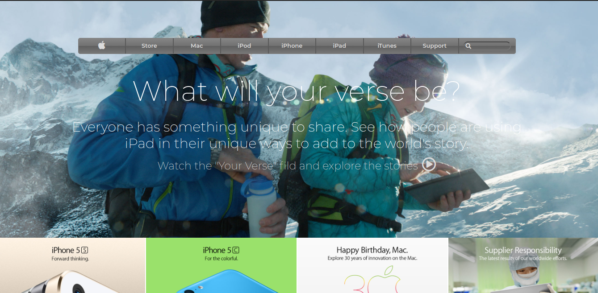

# Apple homepage clone

> A clone of a of the old apple homepage.

In this project, we have created a replica of the old apple homepage (https://web.archive.org/web/20140301004610/http://www.apple.com/). We used flexbox, float and grid for positioning and layout. We also used background graident as well as background image.

## Built With

- HTML,
- CSS,
- Font awesome,
- Google fonts

## Live Demo

[Live Demo Link]()

## Authors

👤 **Jorge Torres**

- Github: [@Yors-git](https://github.com/Yors-git)
- Twitter: [@Yors_82](https://twitter.com/Yors_82)

👤 **Meron Ogbai**

- Github: [@meronokbay](https://github.com/meronokbay)
- Twitter: [@MeronDev](https://twitter.com/MeronDev)
- Linkedin: [linkedin](https://linkedin.com/in/meron-ogbai-467414198/)

## 🤝 Contributing

Contributions, issues and feature requests are welcome!

Feel free to check the [issues page]().

## Show your support

Give a ⭐️ if you like this project!
